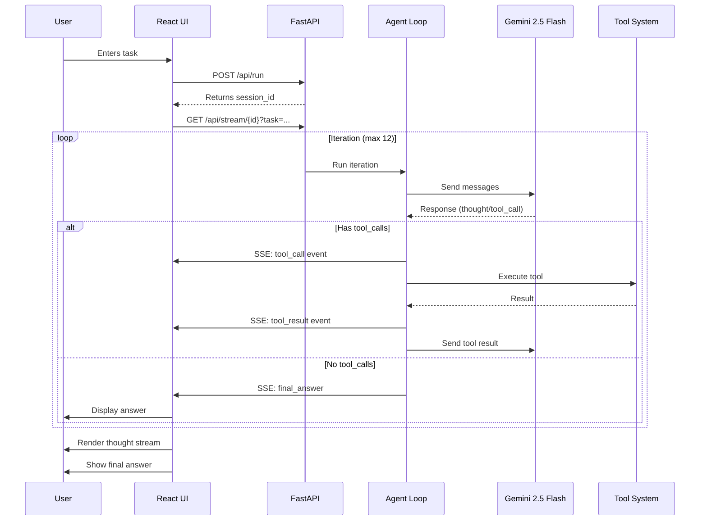

<div align="center">
  
  
  
  
  
  
  <br>
  
  
</div>

<br>

<div align="center">
  <h1>◈ ARIA</h1>
  <h3>Autonomous Research & Intelligence Agent</h3>
  <p><em>Give me any task. I'll think, search, code, and reason my way to a complete answer — completely autonomously.</em></p>
</div>

---

## 📋 Table of Contents

- [✨ Overview](#-overview)
- [🎯 Key Features](#-key-features)
- [🏗️ Architecture](#️-architecture)
- [🛠️ Technology Stack](#️-technology-stack)
- [📦 Prerequisites](#-prerequisites)
- [🚀 Quick Start](#-quick-start)
- [📖 Detailed Setup](#-detailed-setup)
- [🔧 Available Tools](#-available-tools)
- [🎨 UI Features](#-ui-features)
- [📊 System Flow](#-system-flow)
- [🔌 API Endpoints](#-api-endpoints)
- [💾 Data Persistence](#-data-persistence)
- [🎯 Use Cases](#-use-cases)
- [🐛 Troubleshooting](#-troubleshooting)
- [🔒 Security](#-security)
- [📈 Performance](#-performance)
- [🤝 Contributing](#-contributing)
- [📄 License](#-license)

---

## ✨ Overview

**ARIA** (Autonomous Research & Intelligence Agent) is a production-grade AI agent that autonomously completes complex tasks through iterative reasoning and tool use. Unlike simple chatbots, ARIA can:

- **Search the web** for real-time information
- **Write and execute Python code** in a sandboxed environment
- **Fetch and analyze webpages** dynamically
- **Perform mathematical calculations** with precision
- **Read and write files** to the local filesystem
- **Reason step-by-step** with transparent decision-making

ARIA leverages **Google's Gemini 2.5 Flash** for fast, intelligent reasoning with 60 requests per minute on the free tier, making it both powerful and accessible.

---

## 🎯 Key Features

### 🤖 Agent Capabilities
- **Multi-iteration reasoning** - Up to 12 autonomous iterations per task
- **Dynamic tool selection** - Automatically chooses and chains tools
- **Transparent execution** - Every thought and action is streamed live
- **Error recovery** - Graceful handling of API errors and malformed inputs

### 🎨 User Interface
- **Dark/Light mode** - System-aware theme with smooth transitions
- **Live thought stream** - Real-time SSE streaming of agent reasoning
- **History sidebar** - Persistent session storage with search
- **PDF export** - Generate professional session reports
- **Responsive design** - Works on desktop and tablet devices

### ⚡ Performance
- **Fast LLM responses** - Powered by Gemini 2.5 Flash
- **Concurrent sessions** - Multiple users supported
- **Efficient streaming** - Server-Sent Events for real-time updates

---

## 🏗️ Architecture

```
┌─────────────────────────────────────────────────────────────┐
│                        Client Browser                        │
│  ┌──────────┐  ┌──────────┐  ┌──────────┐  ┌──────────┐   │
│  │   React  │  │  Framer  │  │  Lucide  │  │  React   │   │
│  │  18.2+   │  │  Motion  │  │   Icons  │  │  Router  │   │
│  └──────────┘  └──────────┘  └──────────┘  └──────────┘   │
└─────────────────────────────────────────────────────────────┘
                              │
                              │ SSE (Server-Sent Events)
                              ▼
┌─────────────────────────────────────────────────────────────┐
│                      FastAPI Backend                         │
│  ┌──────────────────────────────────────────────────────┐  │
│  │                    API Gateway                         │  │
│  │  • /api/run - Start task                             │  │
│  │  • /api/stream - SSE endpoint                        │  │
│  │  • /api/session - Session management                 │  │
│  └──────────────────────────────────────────────────────┘  │
│                              │                               │
│  ┌──────────────────────────────────────────────────────┐  │
│  │                    Agent Loop                         │  │
│  │  • Iteration control (max 12)                        │  │
│  │  • Message history management                        │  │
│  │  • Tool call dispatch                                │  │
│  └──────────────────────────────────────────────────────┘  │
│                              │                               │
│  ┌────────────┐  ┌────────────┐  ┌────────────┐           │
│  │   Gemini   │  │   Tavily   │  │   Redis    │           │
│  │   2.5 FF   │  │   Search   │  │   (opt)    │           │
│  └────────────┘  └────────────┘  └────────────┘           │
└─────────────────────────────────────────────────────────────┘
```

---

## 🛠️ Technology Stack

### Backend
| Technology | Version | Purpose |
|------------|---------|---------|
| **Python** | 3.10+ | Core runtime |
| **FastAPI** | 0.115+ | Web framework |
| **Google GenAI** | 0.7+ | Gemini 2.5 Flash LLM |
| **Tavily** | Latest | Web search API |
| **Redis** | 7.0+ | Session storage (optional) |
| **Uvicorn** | 0.32+ | ASGI server |
| **HTTPX** | 0.28+ | Async HTTP client |

### Frontend
| Technology | Version | Purpose |
|------------|---------|---------|
| **React** | 18.2+ | UI framework |
| **Vite** | 5.0+ | Build tool |
| **Framer Motion** | 11.0+ | Animations |
| **React Router** | 6.20+ | Navigation |

### APIs & Services
| Service | Purpose | Free Tier |
|---------|---------|-----------|
| **Google Gemini** | LLM inference | 60 requests/min |
| **Tavily** | Web search | 1,000 searches/month |
| **Redis** | Session cache | Unlimited (local) |

---

## 📦 Prerequisites

### Required
- **Python 3.10 or higher** - [Download](https://www.python.org/downloads/)
- **Node.js 18+ and npm** - [Download](https://nodejs.org/)
- **Git** (optional) - [Download](https://git-scm.com/)

### API Keys (Free)
1. **Google Gemini API Key** - [Get here](https://aistudio.google.com/)
   - Sign up with Google account
   - Click "Get API Key"
   - Copy the key (free, no credit card)

2. **Tavily API Key** - [Get here](https://tavily.com)
   - Sign up for free tier
   - Dashboard → Copy API key (1,000 free searches/month)

### Optional
- **Redis Server** - For session persistence
  ```bash
  # Windows (with winget)
  winget install Redis.Redis
  
  # macOS
  brew install redis
  
  # Linux (Ubuntu/Debian)
  sudo apt-get install redis-server
  ```

---

## 🚀 Quick Start

### 1. Clone & Setup

```bash
# Clone the repository
git clone https://github.com/ADITHYA2026/aria-agent.git
cd aria-agent

# Create directory structure
mkdir -p backend frontend
```

### 2. Backend Setup

```bash
cd backend

# Create virtual environment
python -m venv venv

# Activate it
# Windows:
.\venv\Scripts\activate
# macOS/Linux:
source venv/bin/activate

# Install dependencies
pip install -r requirements.txt

# Create .env file
echo GEMINI_API_KEY=your_gemini_key_here >> .env
echo TAVILY_API_KEY=your_tavily_key_here >> .env
echo REDIS_URL=redis://localhost:6379 >> .env

# Start the server
uvicorn main:app --reload --port 8000
```

### 3. Frontend Setup (New Terminal)

```bash
cd frontend

# Install dependencies
npm install

# Start dev server
npm run dev
```

### 4. Access ARIA

Open your browser to: **http://localhost:5173**

---

## 📖 Detailed Setup

### Environment Configuration

Create `.env` in the `backend/` directory:

```env
# Required
GEMINI_API_KEY=your_gemini_key_here
TAVILY_API_KEY=your_tavily_key_here

# Optional (defaults shown)
REDIS_URL=redis://localhost:6379
MAX_ITERATIONS=12
MODEL=gemini-2.5-flash
CORS_ORIGINS=http://localhost:5173,http://localhost:3000
```

### Redis Configuration (Optional)

ARIA uses Redis for session storage. If Redis isn't running, the app continues to work (sessions won't persist across restarts).

**Start Redis:**
```bash
# Windows (if installed via winget)
redis-server

# macOS (Homebrew)
brew services start redis

# Linux (systemd)
sudo systemctl start redis
```

**Verify Redis is running:**
```bash
redis-cli ping
# Should return: PONG
```

---

## 🔧 Available Tools

ARIA comes with 6 powerful tools that the agent can use autonomously:

### 1. 🔍 Web Search (`web_search`)
```json
{
  "query": "latest developments in quantum computing 2025",
  "max_results": 5
}
```
- **Description**: Searches the internet for real-time information
- **Provider**: Tavily API (1000 free searches/month)
- **Returns**: Answer summary + list of results with titles, URLs, and content snippets

### 2. ◈ Code Execution (`execute_code`)
```json
{
  "code": "def fibonacci(n):\n    a, b = 0, 1\n    for _ in range(n):\n        yield a\n        a, b = b, a + b\n\nlist(fibonacci(10))",
  "language": "python"
}
```
- **Description**: Writes and executes Python code in a sandbox
- **Security**: Blocks dangerous operations (os.system, eval, exec, etc.)
- **Timeout**: 20 seconds per execution
- **Returns**: stdout, stderr, return code

### 3. ⊹ Fetch Webpage (`fetch_webpage`)
```json
{
  "url": "https://en.wikipedia.org/wiki/Artificial_intelligence"
}
```
- **Description**: Fetches and extracts text content from any URL
- **Features**: Follows redirects, strips HTML tags
- **Returns**: Cleaned text content (first 5000 chars)

### 4. ∑ Calculate (`calculate`)
```json
{
  "expression": "sum([i**2 for i in range(1, 11)])"
}
```
- **Description**: Safely evaluates mathematical expressions
- **Support**: All Python math functions (sin, cos, sqrt, log, etc.)
- **Security**: No access to system functions or builtins

### 5. ◻ Read File (`read_file`)
```json
{
  "path": "./data/example.txt"
}
```
- **Description**: Reads content from local files
- **Security**: Restricted to current directory (no directory traversal)
- **Returns**: File content (first 5000 chars)

### 6. ◼ Write File (`write_file`)
```json
{
  "path": "./output/result.txt",
  "content": "ARIA generated this content automatically"
}
```
- **Description**: Writes content to local files
- **Security**: Restricted to current directory
- **Returns**: Success status and bytes written

---

## 🎨 UI Features

### Theme System
- **Dark Mode** (default): Cinematic dark theme with ambient glows
- **Light Mode**: Clean, professional light theme
- **Persistence**: Theme preference saved to localStorage
- **Smooth transitions**: CSS variables for instant theme switching

### Thought Stream
Real-time visualization of agent's reasoning:
- 💭 **Thoughts** - Agent's internal reasoning
- 🔧 **Tool Calls** - When and why tools are used
- 📊 **Tool Results** - What each tool returned
- ⚡ **Status Updates** - Progress notifications
- 🔄 **Iteration Counter** - Current iteration number

### History Sidebar
- 📜 **Session History** - All past sessions stored locally
- 🔍 **Search** - Find sessions by task description
- 🏷️ **Status Indicators** - Done, Running, Error states
- 🛠️ **Tool Tags** - Shows which tools were used
- 🗑️ **Delete** - Remove individual sessions
- 🧹 **Clear All** - Reset entire history

### PDF Export
- 📄 **Professional Reports** - Generate session summaries
- 📊 **Statistics** - Thoughts, tool calls, iterations
- 🎯 **Task & Answer** - Complete session details
- 💾 **Print/Download** - Browser print dialog for saving

---

## 📊 System Flow



---

## 🔌 API Endpoints

### Start a Task
```http
POST /api/run
Content-Type: application/json

{
  "task": "Research quantum computing",
  "session_id": "optional-uuid"
}
```

**Response:**
```json
{
  "session_id": "abc-123-def",
  "status": "started"
}
```

### Stream Events (SSE)
```http
GET /api/stream/{session_id}?task={encoded_task}
Accept: text/event-stream
```

**Event Types:**
```javascript
// Thought event
{ "type": "thought", "content": "I need to search for..." }

// Tool call event
{ "type": "tool_call", "tool_name": "web_search", "tool_input": {...} }

// Tool result event
{ "type": "tool_result", "tool_name": "web_search", "tool_output": {...} }

// Final answer
{ "type": "final_answer", "content": "Based on my research..." }

// Status update
{ "type": "status", "content": "Agent initialized..." }

// Iteration counter
{ "type": "iteration", "iteration": 3 }

// Done signal
{ "type": "done", "session_id": "abc-123" }
```

### Get Session History
```http
GET /api/session/{session_id}
```

**Response:**
```json
{
  "session_id": "abc-123",
  "task": "Research...",
  "events": [...],
  "status": "completed",
  "created_at": "2025-01-15T10:30:00Z"
}
```

### Health Check
```http
GET /api/health
```

**Response:**
```json
{
  "status": "ok",
  "agent": "ARIA",
  "version": "1.0.0"
}
```

---

## 💾 Data Persistence

### Session Storage (Redis - Optional)
- **Key pattern**: `session:{session_id}`
- **TTL**: 3600 seconds (1 hour) for active sessions
- **Extended TTL**: 7200 seconds (2 hours) for completed sessions
- **Data**: Full session history including all events

### History Storage (LocalStorage - Frontend)
- **Key**: `aria-history`
- **Max sessions**: 50 (auto-rotate)
- **Data per session**:
  ```json
  {
    "id": "uuid",
    "task": "User task",
    "status": "completed",
    "createdAt": "ISO timestamp",
    "toolsUsed": ["web_search", "execute_code"],
    "finalAnswer": "Final response text"
  }
  ```

---

## 🎯 Use Cases

### Research & Analysis
- Market research on companies/products
- Technical literature review
- News aggregation and summarization
- Competitive analysis

### Development Assistance
- Generate and test code snippets
- Debug algorithms
- Explain programming concepts
- Create technical documentation

### Data Processing
- Transform data with Python scripts
- Calculate complex metrics
- Parse and analyze CSV/JSON files
- Generate reports

### Education
- Explain complex topics
- Solve math problems step-by-step
- Generate practice exercises
- Research assistance for students

### Content Creation
- Research and write articles
- Summarize long documents
- Extract key insights from webpages
- Compile research reports

---

## 🐛 Troubleshooting

### Common Issues & Solutions

#### 1. "Gemini API error: API key invalid"
**Solution**: Your Gemini API key is invalid or missing.
```bash
# Check your .env file
cat backend/.env
# Ensure GEMINI_API_KEY is present and correct
```

#### 2. "ModuleNotFoundError: No module named 'google'"
**Solution**: Missing Google GenAI dependency.
```bash
cd backend
pip install google-genai
```

#### 3. Connection refused to localhost:8000
**Solution**: Backend isn't running.
```bash
cd backend
uvicorn main:app --reload --port 8000
```

#### 4. Redis connection errors (optional)
**Solution**: Redis isn't required, but you'll see warnings.
```bash
# Either install Redis or ignore the warnings
# The app works fine without Redis (sessions won't persist)
```

#### 5. CORS errors in browser console
**Solution**: Update CORS origins in config.py
```python
cors_origins: list[str] = [
    "http://localhost:5173",
    "http://localhost:3000",
    "http://127.0.0.1:5173"
]
```

#### 6. Code execution blocked
**Solution**: Sandbox security is working as designed.
```python
# Remove blocked operations from your code:
# - os.system, subprocess calls
# - eval(), exec()
# - File operations outside current directory
```

---

## 🔒 Security

### Code Execution Sandbox
- ✅ Only Python code allowed
- ✅ 20-second timeout limit
- ✅ Blocked dangerous operations:
  - `os.system`, `subprocess`
  - `eval()`, `exec()`
  - `__import__`, `compile`
  - `breakpoint()`
- ✅ Temporary file cleanup after execution
- ✅ Output size limits (3000 chars stdout, 1000 chars stderr)

### File System Security
- ✅ Restricted to current working directory
- ✅ No directory traversal (`../` blocked)
- ✅ Read/write size limits (5000 chars)
- ✅ File type restrictions (UTF-8 text only)

### API Security
- ✅ CORS configured for specific origins
- ✅ Environment variables for API keys
- ✅ No hardcoded credentials
- ✅ Session isolation between users

### Input Validation
- ✅ Task length limits (3-2000 characters)
- ✅ JSON schema validation for tool inputs
- ✅ HTML sanitization for web content
- ✅ URL validation for fetch_webpage

---

## 📈 Performance

### Benchmarks
| Metric | Value |
|--------|-------|
| **Time to first token** | ~300ms |
| **Average iteration** | 2-3 seconds |
| **Max iterations** | 12 (configurable) |
| **Concurrent sessions** | Unlimited (limited by RAM) |
| **Response streaming** | Real-time (SSE) |

### Optimizations
- **Async/await** throughout for non-blocking I/O
- **Connection pooling** with HTTPX
- **Efficient JSON serialization** with Pydantic v2
- **Lazy loading** of tools
- **Streaming responses** for immediate feedback

### Resource Usage
- **Backend memory**: ~200MB base + ~50MB per active session
- **Frontend memory**: ~100MB base
- **CPU usage**: Minimal except during code execution

---

## 🤝 Contributing

We welcome contributions! Here's how you can help:

### Development Workflow

1. **Fork the repository**
2. **Create a feature branch**
   ```bash
   git checkout -b feature/amazing-feature
   ```

3. **Make your changes**
   - Follow existing code style
   - Add comments for complex logic
   - Update documentation

4. **Test your changes**
   ```bash
   # Backend tests (if added)
   pytest backend/tests/
   
   # Frontend linting
   cd frontend && npm run lint
   ```

5. **Commit with clear message**
   ```bash
   git commit -m 'Add amazing feature: brief description'
   ```

6. **Push and open Pull Request**

### Areas for Improvement

- [ ] Add unit tests for tools
- [ ] Implement WebSocket fallback for SSE
- [ ] Add more tool providers (Bing, Google Search)
- [ ] Support for more programming languages
- [ ] Docker Compose setup
- [ ] Rate limiting middleware
- [ ] User authentication
- [ ] Database support (PostgreSQL)
- [ ] Model switching UI
- [ ] Custom tool creation interface

---

## 📄 License

This project is licensed under the MIT License - see below:

```
MIT License

Copyright (c) 2025 ARIA Contributors

Permission is hereby granted, free of charge, to any person obtaining a copy
of this software and associated documentation files (the "Software"), to deal
in the Software without restriction, including without limitation the rights
to use, copy, modify, merge, publish, distribute, sublicense, and/or sell
copies of the Software, and to permit persons to whom the Software is
furnished to do so, subject to the following conditions:

The above copyright notice and this permission notice shall be included in all
copies or substantial portions of the Software.

THE SOFTWARE IS PROVIDED "AS IS", WITHOUT WARRANTY OF ANY KIND, EXPRESS OR
IMPLIED, INCLUDING BUT NOT LIMITED TO THE WARRANTIES OF MERCHANTABILITY,
FITNESS FOR A PARTICULAR PURPOSE AND NONINFRINGEMENT. IN NO EVENT SHALL THE
AUTHORS OR COPYRIGHT HOLDERS BE LIABLE FOR ANY CLAIM, DAMAGES OR OTHER
LIABILITY, WHETHER IN AN ACTION OF CONTRACT, TORT OR OTHERWISE, ARISING FROM,
OUT OF OR IN CONNECTION WITH THE SOFTWARE OR THE USE OR OTHER DEALINGS IN THE
SOFTWARE.
```

---

## 🙏 Acknowledgments

- **Google** for Gemini 2.5 Flash and generous free tier
- **Tavily** for search API with generous free tier
- **FastAPI** for the excellent async framework
- **React & Framer Motion** for the smooth UI experience
- **Open Source Community** for the amazing tools

---

## 📞 Support & Contact

- **Issues**: [GitHub Issues](https://github.com/ADITHYA2026/aria-agent/issues)
- **Discussions**: [GitHub Discussions](https://github.com/ADITHYA2026/aria-agent/discussions)
- **Email**: aria-agent@example.com

---

<div align="center">
  <h3>Built with ◈ by ARIA Team</h3>
  <p><i>Autonomous agents for everyone</i></p>
  
  <br>
  
  [Report Bug](https://github.com/ADITHYA2026/aria-agent/issues) · 
  [Request Feature](https://github.com/ADITHYA2026/aria-agent/issues) · 
  [Star on GitHub](https://github.com/ADITHYA2026/aria-agent)
</div>
```

---